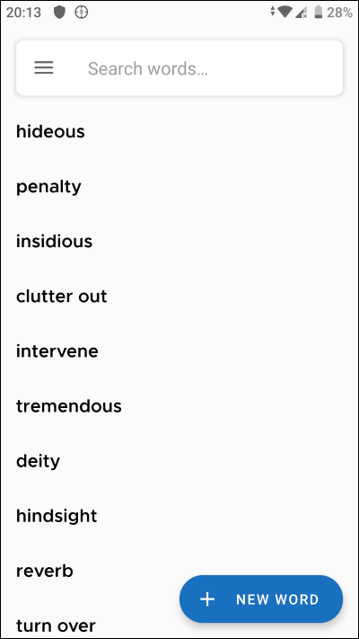

# Clich
## Words saving app
##### An app by which you can create words, add to them definitions, examples, and organize words in labels as well

### Technology stack:
- Kotlin
- MVVM
- Room
- Dagger 2
- Coroutines
- Kakao

### Screenshots:
------------

