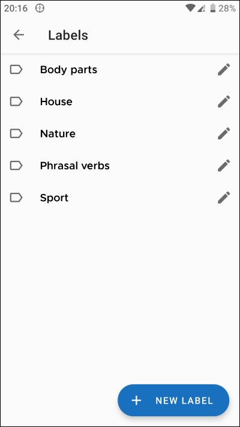

# ARCHIVED: This once was my pet project, it is no longer maintained ;)

# Clich
## Words saving app
#### An app wehere you can create words, add definitions and examples to them, and also organize them in labels

### Technology stack:
- Kotlin
- MVVM
- Room
- Dagger 2
- Coroutines
- Kakao

### Screenshots:

